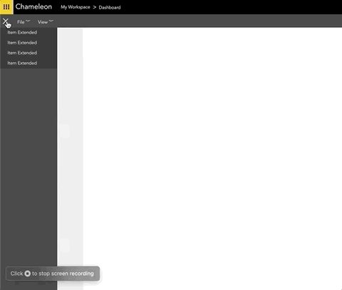

# Dashboard

### Demo


### Project setup
Setup and install
```
npm install
```

### Compiles and hot-reloads for development
```
npm run serve
```
Once started page will be served up on http://localhost:8080
